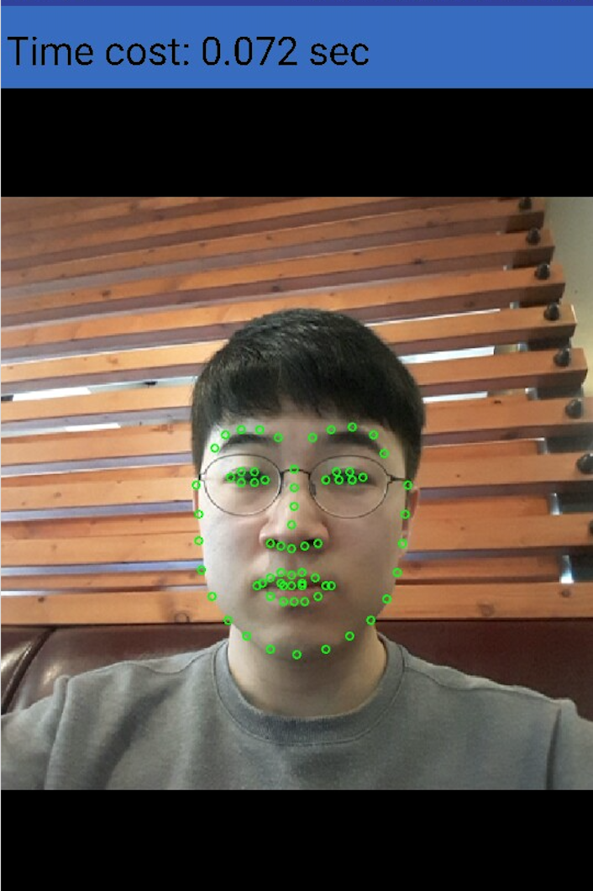

# Live Face Detection - android

Live face detection on android using dlib.

## Usage

1. `git clone `
2. Import the project into android studio.
3. Run.

## Features

It supports four function for live human detection. It's actually part of my another project.

1. Face Detection
2. Facial Landmark Detection
3. Head Rotating Detection
4. Eye-close Dtection

## Demo

### Environments

* DEVICE : SAMSUNG-A8 2015(@cortex-a53 core)
* API    : 23 (Android 6.0.1)
* TIME   : 50ms ~ 70ms

### Online live face detection

## Credits

*  [dlib-android](https://github.com/tzutalin/dlib-android)

